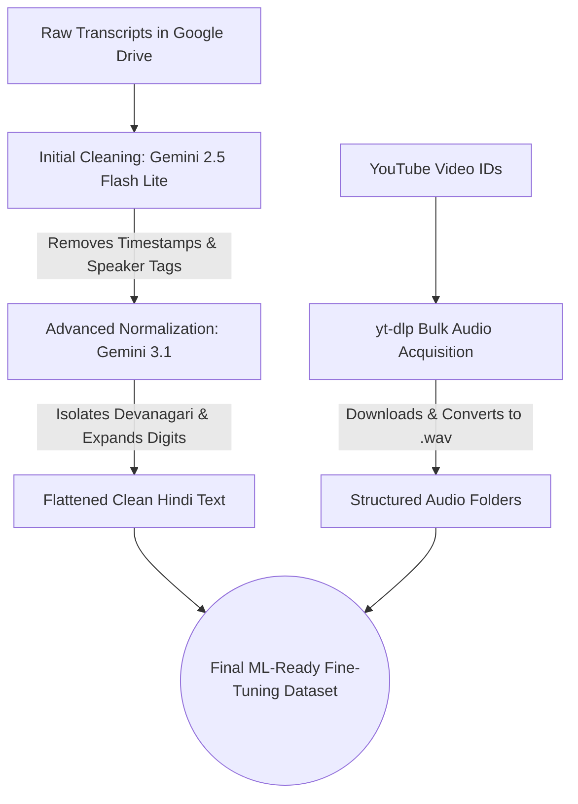

# 📓 YADEP & YouTube Audio Utility Notebooks

This directory contains the core execution notebooks for the **YouTube Audio Dataset Extraction Pipeline (YADEP)** and its accompanying interactive helper utility. These notebooks are designed to run in Google Colab (with GPU acceleration where specified) to fetch, process, transcribe, and analyze audio files from YouTube.

---

## 📊 Notebook Comparison & Overview

| Feature / Metric | 🚀 `YADEP.ipynb` (Main Pipeline) | 🛠️ `Helper_Notebook_to_download_Audio_from_YT.ipynb` (Helper Utility) | 🧹 `Hindi_Speech_Dataset_Cleaner_and_Downloader.ipynb` |
| :--- | :--- | :--- | :--- |
| **Primary Purpose** | Bulk machine learning audio-text dataset compilation. | Interactive single-video download, transcription, and QA chat. | Automated cleaning and normalization of Hindi transcripts for fine-tuning. |
| **Execution Mode** | Automated Batch Pipeline. | Interactive/Semi-automated Step-by-Step. | Batch processing across directory structures. |
| **ASR Engine** | Local `OpenAI Whisper Large V3` (Hugging Face). | Remote `Gemini API` via Google GenAI SDK. | Remote `Gemini API` (2.5 & 3.1 Flash Lite). |
| **Input Source** | YouTube Playlist URL or Single Video URL. | Interactive Link or Video ID input prompt. | Raw transcripts and YouTube IDs from Google Drive. |
| **Storage / Output** | Local workspace subdirectories under `KrishiDarshan/` + dataset CSV files. | Google Colab temporary directory / Automated Google Drive Save. | FineTuning_Dataset folder in Google Drive. |
| **Hardware Requirement** | **GPU (T4 or higher)** for Whisper model inference. | **CPU** (runs entirely on API calls). | **CPU** (runs entirely on API calls). |
| **Key Constraints Met** | Bypasses YouTube throttling and prevents RAM crash/OOM. | Interactive Gemini model selector dropdown and chat loop. | Intelligent backoff error handling, non-Devanagari isolation, digit conversion. |

---

## 🚀 Deep Dive: `YADEP.ipynb` (Main Pipeline)

This is the main production notebook for YADEP. It systematically processes a playlist or video source, downloading audio files, slicing them into uniform ML-ready 30-second segments, performing GPU-accelerated local transcription, and assembling structural dataset indexes.

### 📋 Phase-by-Phase Execution Sequence

The notebook is structured into 14 consecutive code cells representing the 12 pipeline phases:

1. **Cell 0: Environment Provisioning**: Installs ffmpeg decoders and pip packages (`yt-dlp`, `pydub`, `transformers`, `torch`, `accelerate`).
2. **Cell 1: Input Gate Validation**: Sets the target URL source (`TARGET_URL`).
3. **Cell 2: Metadata Extraction**: Scans indices for Video ID, Title, Duration, and Channel.
4. **Cell 3: Dataset Ingestion Spreadsheet**: Compiles metadata into `YT_DATASET.csv` and filters out duplicates.
5. **Cell 4: Workspace Isolation Setup**: Filters out videos exceeding duration thresholds and creates isolated workspaces (`KrishiDarshan/<VIDEO_ID>`).
6. **Cell 5 & 6 (Setup & Verify): Deno JS Engine Provisioning**: Installs the Deno runtime environment to Colab and runs a verification test to resolve YouTube's `n-challenge` throttling.
7. **Cell 7: Master Audio Acquisition**: Runs bulk downloads and encodes streams into `audio.mp3`.
8. **Cell 8: Preprocessing & 30-Second Slicing**: Compiles `VERIFIED_AUDIO_INDEX.csv` and segments master tracks into atomic 30-second `.mp3` frames.
9. **Cell 9: Optimization Verification**: Audits hardware constraints (GPU, CUDA pathways) before starting transcription.
10. **Cell 10: Speech Recognition Pipeline**: Runs memory-optimized transcription using `whisper-large-v3` with float16 matrices and automated RAM garbage collection.
11. **Cell 11: Output Multiplexer**: Generates `transcript.txt`, `transcript_timestamps.txt`, and `transcript.json` within each video's workspace.
12. **Cell 12: QA Audit & Logging**: Runs layout checks and generates the pipeline audit file (`QUALITY_AUDIT_REPORT.md`).
13. **Cell 13: Final Machine Learning Matrix Compiler**: Compiles the final training tables `FINAL_VIDEO_MANIFEST.csv` and `FINAL_ML_TRAINING_CHUNKS.csv`.

---

## 🛠️ Deep Dive: `Helper_Notebook_to_download_Audio_from_YT.ipynb`

This notebook serves as an interactive utility. It enables users to quickly download any single YouTube audio track, generate highly detailed verbatim transcripts, and converse with the audio context using the Gemini API.

### 📋 Functional Components

1. **Audio Download and Processing**: 
   - Utilizes `yt-dlp` and `ffmpeg` to extract audio.
   - Provides an interactive input box where you paste your YouTube Link or Video ID.
   - Automatically saves the audio as a `.wav` file.
2. **Gemini API Setup**:
   - Installs the new `google-genai` client SDK.
   - Requires your `GOOGLE_API_KEY` stored in Google Colab's Secrets (Userdata).
   - Generates an interactive ipywidget dropdown menu to select between Gemini models: `gemini-3.5-flash`, `gemini-1.5-flash`, `gemini-1.5-pro`, or `gemini-2.5-flash`.
3. **High-Precision Verbatim Transcription**:
   - Instructs Gemini to transcribe the audio into Hindi with specific parameters: speaker identification, timestamping rules (beginning of every speaker turn or every 45 seconds of continuous talk), and verbatim accuracy for agricultural dialects.
4. **Interactive Chat Loop**:
   - Initiates an ongoing conversation session with the audio file as context.
   - Lets you ask arbitrary questions about the audio contents interactively until you type `exit`.
6. **Google Drive Export**:
   - Mounts Google Drive and automatically exports the generated transcripts.

---

## 🧹 Deep Dive: `Hindi_Speech_Dataset_Cleaner_and_Downloader.ipynb`

This notebook handles the crucial "Dataset Preparation" phase. It automatically cleans and normalizes raw Hindi transcripts generated by the pipeline, stripping out metadata (like timestamps and speaker tags), converting numbers and symbols into spoken Devanagari words, flattening text, and downloading the corresponding `.wav` audio files.

### 📋 Dataset Preparation Flowchart

### 📋 Execution Steps

1. **Migration and Initial Metadata Removal**: Scans Google Drive and uses Gemini 2.5 Flash Lite to securely strip out all `[HH:MM:SS]` timestamps and speaker identifiers. Uses intelligent backoff logic to prevent rate-limit crashes.
2. **Advanced Script Normalization**: Engages Gemini 3.1 Flash Lite to isolate Devanagari script, removing English characters and converting numerical digits (e.g., `5` -> `पाँच`) and symbols (e.g., `%` -> `प्रतिशत`) into phonetically spelled Hindi equivalents.
3. **Targeted Batch Processing**: Provides an isolated code block to cleanly re-run specific subsets of video IDs without reprocessing the entire database.
4. **Bulk Audio Acquisition**: Uses `yt-dlp` to download the specific target video IDs directly into `.wav` formats, organizing them into directories side-by-side with the cleaned `.txt` transcripts.

---

## 🛠️ Prerequisites & Setup Guide

### 🔑 Google API Key Setup (For Gemini Helper)
Before running the Helper Notebook, ensure you add your Gemini API Key to Google Colab:
1. In Colab, click the **Secrets** icon (the key symbol 🔑 in the left sidebar).
2. Add a new secret with the name **`GOOGLE_API_KEY`**.
3. Paste your Gemini API key as the Value.
4. Enable **Notebook Access** for the secret.

### 💻 Colab GPU Runtime (For YADEP Pipeline)
The Whisper ASR engine in `YADEP.ipynb` requires GPU acceleration:
1. Go to **Runtime > Change runtime type** in the Colab menu.
2. Under **Hardware accelerator**, select **T4 GPU** (or any higher GPU available).
3. Click **Save**.

### 📦 System Prerequisites
Both notebooks automate the installation of missing system binaries (`ffmpeg`) and external runtimes (`Deno`). Ensure your runtime has internet access to allow:
- `yt-dlp` to download dependencies.
- Hugging Face (`huggingface.co`) to download model weights.
